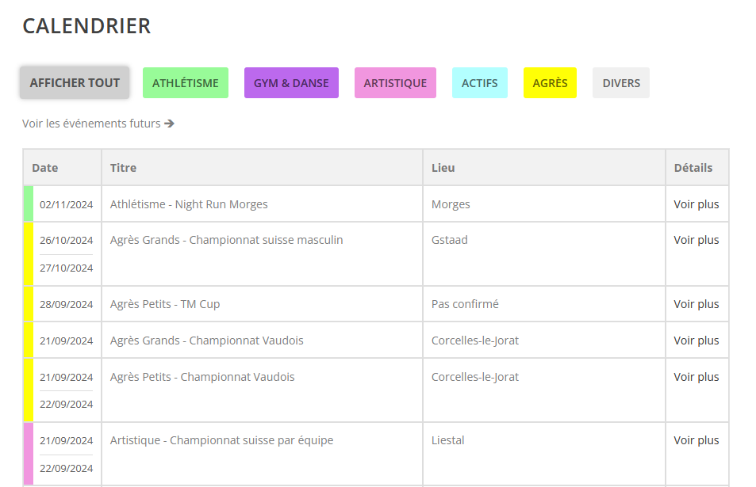

## Plugin WP pour afficher les events d'un calendrier google pour le site gymmorges.ch

- Voir les events passés et futures
- Redirectiuon vers le calendrier google
- Filtre de couleur par groupes
  - Pour que les filtres fonctionent, il faut mettre le nom du groupe dans le titre de l'event
    - ex : "Athlétisme - xxxx"

Exemple : https://www.gymmorges.ch/calendrier-gym-morges/

